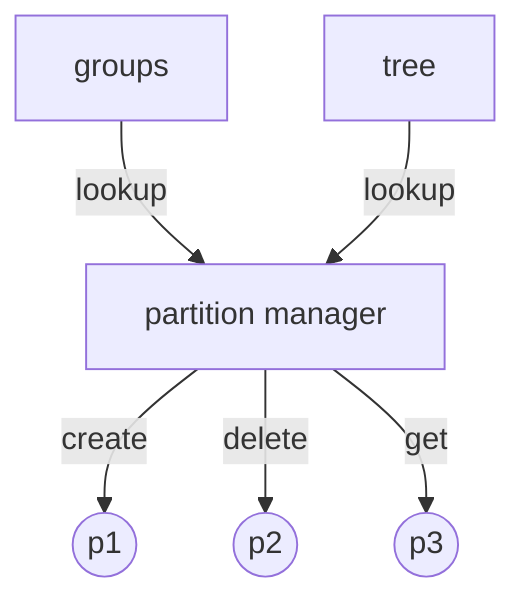

# Experimental Partitions

This repository was created to show another way to think about how state management partitioning might be designed. The API is effectively designed as follows:

`Partition`s represent logical separations containing hardware information that are mutually exclusive and are encapsulated (not exported) within the `partition` package. There is no mechanism to interact directly with partitions. Instead, the only way to interact with partitions is through the `PartitionManager`. The `PartitionManager` enforces the mutually exclusivity behavior between the `Partition`s, which can be possibly extended to enforce other rules such as permissions and/or roles.

On the other hand, `Group`s are *completely unrelated to partitions*. A `Group` is simply a collection of labels that have no specific behavior, but can be useful for performing hardware information lookups through the `PartitionManager`. The functionality for `Group`s is built on top of the `PartitionManager`. Similarly, other abstract data structures like a `Tree` can be built using the `PartitionManager` in the same way as `Group`s.